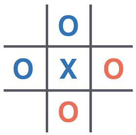

# RL for Wild Tic-Tac-Toe :o::x:

Wild Tic-Tac-Toe is a twist on the classic game of Tic-Tac-Toe.




## Rules of Wild Tic-Tac-Toe

Like normal Tic-Tac-Toe, both players attempt to play 3 of the same counter (`O` or `X`) in a row on a **3 x 3** grid.

**The twist is that both players can choose to play an `O` or a `X`** on any move. The winner is whoever plays the **3rd `X` or `O` in a line** (horizontally, vertically or diagonally) of `X`'s or `O`'s.


In the image above, you can see a win for blue (player 1) resulting from 3 `X`'s, 2 of which were played by blue and 1 by red (player 2). Player 1 goes first, so has placed the winning counter here.


In this image, you can see an ongoing game. You are player 2, playing the red counters. There are `12` possible moves you could make, since you can place an `X` or an `O` on any empty space.

Think about why it may be wise to play an `O` here!


# Competition Rules :crossed_swords:
1. You must build a **Reinforcement Learning agent** that plays **Wild Tic-Tac-Toe**.
    - You can only store data to be used in a competition in a dictionary (saved in a `.pkl` file by `save_dictionary()` which is a function in `game_mechanics.py`)
    - In the competition, your agent will call the `choose_move()` function in `main.py` to select a move
    - Any code not in `main.py` will not be used.
2. Submission deadline: **5pm GMT, Saturday**.
    - **How to submit**: Hit **SUBMIT** in the top right of replit. You can update your code after you submit, but not after the deadline.
3. The competition will consist of your AI playing other teams' AIs 1-v-1 in a knockout tournament fashion.
    - Each 1-v-1 matchup will consist of a pair of games. Each player starts one of the 2 games. In the event of a tie, it will go to **sudden-death duel** (tiebreaker games). These will also be in pairs with 1 player starting each one.

The competition & discussion will be in [Gather Town](https://app.gather.town/app/nJwquzJjD4TLKcTy/Delta%20Academy) at **5pm GMT on Saturday** (30 mins after submission deadline)!


## Technical Details

### The **`choose_move()`** Function

In the competition, the **`choose_move()`** function is called to make your next move. 

**Inputs:**
- The board - a flat list of strings `""` for empty, `"X"` or `"O"`, where the grid below shows how the list index corresponds to locations on the board. E.g. top left corner is the first element of the list. 

```
0 | 1 | 2
3 | 4 | 5
6 | 7 | 8
```

E.g. `["O", "", "", "O", "", "X", "", "", "X"]` represents:
              
```
O |   |
O |   | X
  |   | X
```


- The Python Dictionary you have saved as a `.pkl` file

**`choose_move()` outputs a tuple of:**
- The location to place the counter in as an integer `0 <= location <= 8`
- The counter to place (either `"X"` or `"O"`)

### The **`train()`** Function

Function signature in place - expects you to write something that trains the dictionary and outputs it to save it.

**Inputs**:

- `game`: an `Env` object which should be used by both teams to select a move.

**Outputs**:

- Value function dictionary that you've trained (this should then saved by `save_dictionary()` so you can submit a `.pkl` file)

### The **`render()`** Function
- Plays a single graphical game against a randomly moving opponent. You play as player1 (the blue team).  

**Inputs:**
- choose_move (Callable) - your choose_move function 
- my_dict (Dict) - The dictionary you saved through your `train()` function


## Guidance on Building a Winning Agent :trophy: 

1. Start by discussing the problem with your partner. Write down what the **state**, the **action** & the **rewards** are for this game.
    - Ie what should your policy take as input & what should it output?
    - Does that take into account the other team's turn?
2. Read the docstrings in `game_mechanics.py`, particularly the `WildTicTacToe` class
3. What should differ between **training** and **playing for real in the competition**? How should this be reflected in your code?
4. What agent do you want to train your agent against? And what do you want to test your agent against?
5. **Not working?** Print, debug & test! Particularly with machine learning, it's very difficult to know if your training algorithm & agent does what you think it does.
    - Print out variables to check they are what you think they are, or that they change in the way you expect them to change
    - Write short tests (e.g. check your agent picks a winning move when choosing greedily, or that it doesn't throw away the game when it could)

## Tips on using Replit :technologist:

- Change the `Indent Size` to `4` which changes how many spaces a `TAB` adds in Replit (Python expects indents of 4, so this is basically a requirement!)
- Change Layout to `side-by-side` (this one is more a personal-preference thing, but I find it much nicer!)
- `Run` (big green button in the top middle) runs the `main.py` file. Even if you have another file you want to run, it'll only run `main.py`.

Where to find Replit settings can be seen in the screenshot below.


